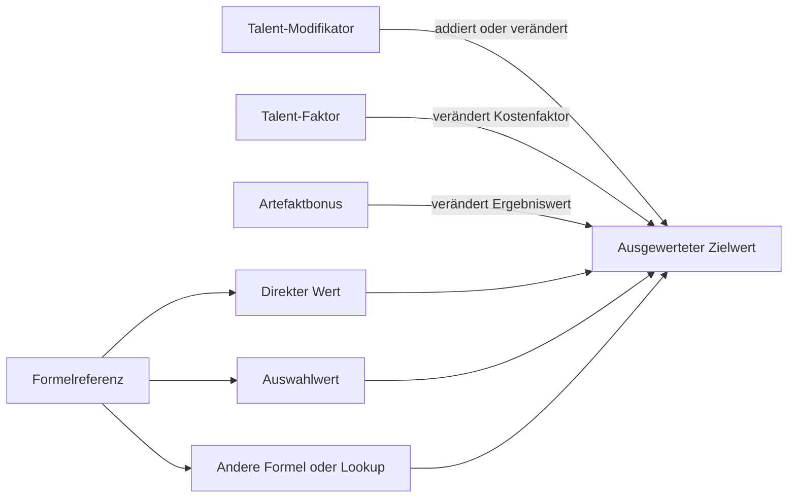
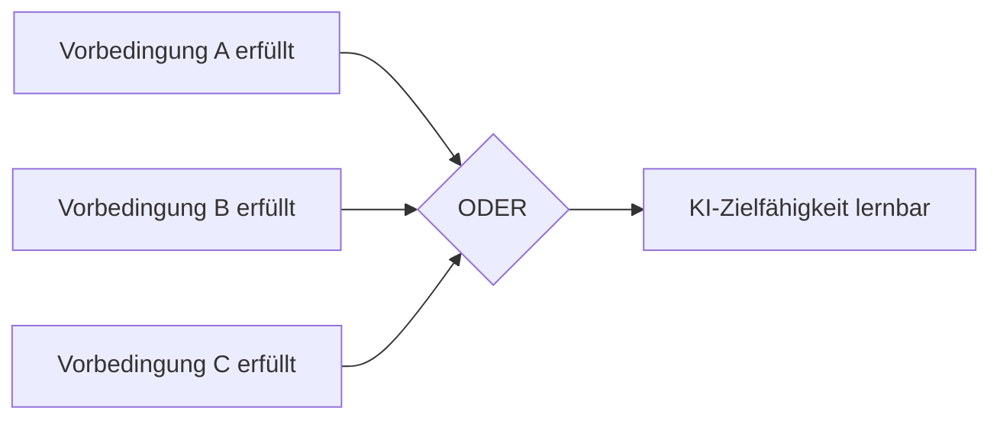
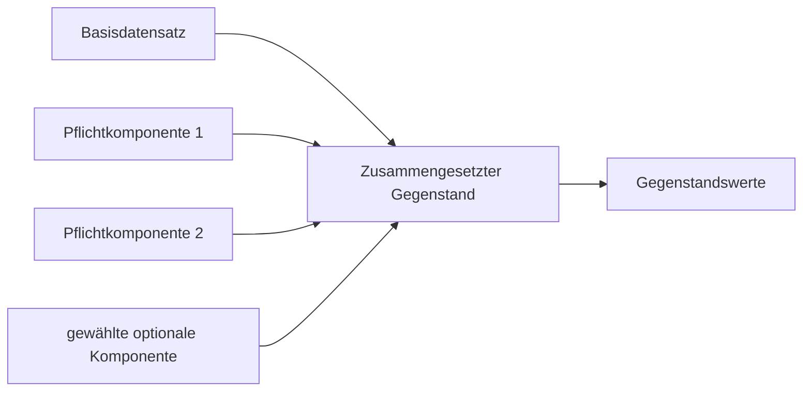
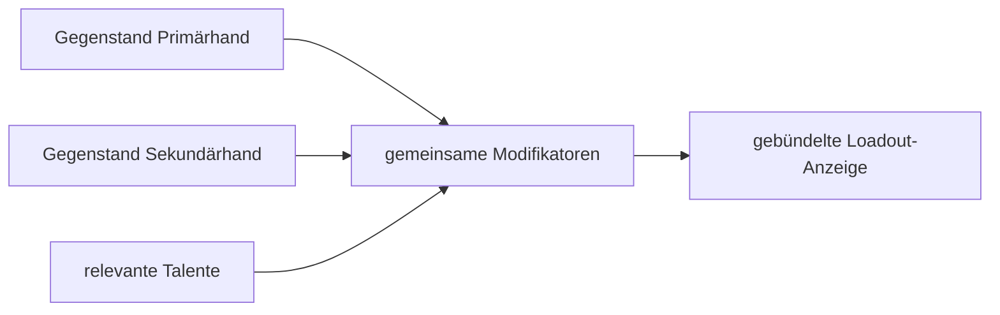

# Relationen der Werte und Regeln im Nasus-Charaktertool

Stand: 28. Juli 2026

## 0. Zweck und Leseregel

Dieses Dokument beschreibt ausschließlich die fachlichen Relationen der erfassten Werte, Regeln und Formeln. Es soll einem anderen Datenmodell ermöglichen, die vorhandenen Abhängigkeiten ohne Kenntnis der aktuellen Benutzeroberfläche oder Speicherstruktur nachzubilden.

Nicht Gegenstand dieses Dokuments sind Speicherorte, Browser-Persistenz, Serverarchitektur und geplante Meisterfunktionen.

Jede Tabellenzeile beschreibt genau eine gerichtete Relation:

```text
Quelle --[Relation]--> Ziel
```

Mehrere Quellen in einer Formel werden deshalb als einzelne Eingangsrelationen aufgeführt. Die vollständige Formel steht anschließend am Zielwert.

### Relationstypen

| Typ | Bedeutung |
|---|---|
| `WERT` | Direkt erfasster numerischer Wert |
| `AUSWAHL` | Erfasste Auswahl oder gekaufte Regel |
| `FORMEL` | Zielwert wird rechnerisch aus Quellen gebildet |
| `LOOKUP` | Zielwert wird über eine Tabelle bestimmt |
| `KOSTEN` | Quelle verbraucht eine Ressource |
| `MAXIMUM` | Quelle begrenzt oder erweitert einen Zielwert |
| `GATE` | Quelle erlaubt oder sperrt Lernen beziehungsweise Steigern |
| `KOMPOSITION` | Mehrere Komponenten bilden einen Gegenstandswert |
| `MODIFIKATOR` | Quelle verändert einen bereits bestehenden Wert |
| `DARSTELLUNG` | Werte werden nur für eine gemeinsame Anzeige gebündelt |
| `REGELTEXT` | Regel ist erfasst, aber nicht als vollständige Laufzeitberechnung aufgelöst |

### Verknüpfungen

| Schreibweise | Bedeutung |
|---|---|
| `UND` | Alle genannten Bedingungen müssen erfüllt sein |
| `ODER` | Mindestens eine Bedingung muss erfüllt sein |
| `MAX(...)` | Der höchste Wert gewinnt |
| `MIN(...)` | Der niedrigste Wert gewinnt |
| `SUMME(...)` | Alle Werte werden addiert |
| `FLOOR(...)` | Abrunden |
| `CEIL(...)` | Aufrunden |

## 1. Sortierte Gesamtübersicht


Die Übersicht ist bewusst azyklisch: Eingaben werden nicht vom berechneten Charakterbogen erzeugt. Berechnete Ergebnisse können lediglich Grenzen, Sperren und Anzeigen für weitere Eingaben liefern.

## 2. Allgemeines Regel- und Formelmodell

### 2.1 Regelarten

| Quelle | Relation | Ziel |
|---|---|---|
| erfasster `values[referenz]` | `WERT` | aktueller Wert einer Regel vom Typ `Wert` |
| erfasster `selections[referenz]` | `AUSWAHL` | Auswahlstatus einer Regel vom Typ `Auswahl` |
| `formelRaw` | `FORMEL` | berechneter Wert einer Regel vom Typ `Formel` |
| Lookup-Formel und Lookup-Tabelle | `LOOKUP` | berechneter Wert einer Regel vom Typ `Lookup` |
| `poolRaw` | `FORMEL` | Gesamtbudget einer Regel vom Typ `Pool` |
| `formelRaw` einer Regel vom Typ `Fixwert` | `DARSTELLUNG` | unverändert angezeigter Text- oder Zahlenwert |
| `kostenRaw` und aktueller Wert | `KOSTEN` | aktuelle Kosten |
| `kostenRaw` und nächster Wert | `KOSTEN` | Kosten nach einer Steigerung |
| `kostenRaw` und vorheriger Wert | `KOSTEN` | Kosten nach einer Senkung |

### 2.2 Referenzauflösung



Eine Referenz, die weder als direkter Wert noch als Auswahl belegt ist, liefert zunächst `0`. Formeln dürfen transitiv andere Formeln und Lookups referenzieren.

## 3. Erfahrung, Stufe, Kreis und Punkteressourcen

### 3.1 Atomare Relationen

| Quelle | Relation | Ziel |
|---|---|---|
| Gesamt-EP | `LOOKUP` über `EP-Stufe-Kreis` | Stufe |
| Gesamt-EP | `LOOKUP` über `EP-Stufe-Kreis` | Kreis |
| Gesamt-EP | `LOOKUP` auf nächsthöhere Schwelle | EP bis zur nächsten Stufe |
| Gesamt-EP | `FORMEL` | SP-Gesamt |
| Stufe | `FORMEL` | TaP-Gesamt |
| Kosten aller gekauften Nicht-Talente | `SUMME` | ausgegebene SP |
| Kosten aller gekauften Talente | `SUMME` | ausgegebene TaP |
| SP-Gesamt | `FORMEL` | verbleibende SP |
| ausgegebene SP | `FORMEL`, wird abgezogen | verbleibende SP |
| TaP-Gesamt | `FORMEL` | verbleibende TaP |
| ausgegebene TaP | `FORMEL`, wird abgezogen | verbleibende TaP |

### 3.2 Formeln

```text
SP-Gesamt = 6490 + Gesamt-EP
verbleibende SP = SP-Gesamt - ausgegebene SP

TaP-Gesamt = 20 + Stufe × 5
verbleibende TaP = TaP-Gesamt - ausgegebene TaP
```

### 3.3 Ausschließliche Kostenzuordnung

| Regelgruppe | Ressource |
|---|---|
| Talente | ausschließlich TaP |
| Eigenschaften | SP |
| Attribute | SP |
| Grundfertigkeiten | SP |
| Sonderfertigkeiten | SP |
| WHK | SP |
| Vor- und Nachteile | SP |
| KI, Psi und Spruchmagie | SP |
| Ausrüstung | Dublonen |

Negative Kosten eines Nachteils erhöhen rechnerisch die verbleibenden SP.

## 4. Eigenschaften, Attribute, Fertigkeiten und Grenzen

### 4.1 Eigenschaften

| Quelle | Relation | Ziel |
|---|---|---|
| Spezies | `MAXIMUM` | Erstellungsminimum einer Eigenschaft |
| Spezies | `MAXIMUM` | Erstellungsmaximum einer Eigenschaft |
| Kreis | `MAXIMUM` | Auswahl zwischen Erstellungsmaximum und Maximum ab Kreis 3 |
| „Schlechte Eigenschaft“ | `MAXIMUM`, überschreibt Speziesvorgabe | Maximum der betroffenen Eigenschaft |
| Maximum-Talent | `MAXIMUM` | erhöht Maximum der adressierten Referenz oder Gruppe |
| Artefaktbonus | `MODIFIKATOR` | angezeigter veränderter Eigenschaftswert |

```text
Eigenschaftsminimum = Erstellungsminimum der Spezies

Eigenschaftsmaximum =
    Erstellungsmaximum der Spezies, wenn Kreis < 3
    Maximum-ab-Kreis-3 der Spezies, wenn Kreis >= 3
```

### 4.2 Basismaxima der Fertigkeitsgruppen

Die Gruppen werden getrennt betrachtet. Ein Maximum einer Gruppe ist keine Kardinalität oder Besitzrelation zu einer anderen Gruppe.

| Gruppe | Basismaximum |
|---|---:|
| Grundfertigkeit | 12 |
| Sonderfertigkeit | 12 |
| Nahkampf | 24 |
| Fernkampf | 24 |
| WHK | 24 |
| Spruchmagie | 24 |
| Attribute | 7 |
| KI | 24 |
| Psi | 24 |

Talent-Maximumregeln erhöhen ausschließlich die von ihnen adressierte Referenz, Kategorie oder Zauberschule.

### 4.3 Talentwirkungen

| Quelle | Relation | Ziel |
|---|---|---|
| gewähltes Talent | `MODIFIKATOR` | adressierter Wert |
| gewähltes Talent | `MODIFIKATOR` | Kostenfaktor einer adressierten Regel |
| gewähltes Talent | `MAXIMUM` | Maximum einer adressierten Regel oder Gruppe |
| Talentstufe | `GATE` | nächsthöhere Talentstufe |
| Kampftalent | `MODIFIKATOR` | Waffen-, AT-/PA-, Reichweiten- oder Ladezeitanzeige |
| Meister der Grundfertigkeiten | `GATE` | Zahl wählbarer Grundfertigkeiten |

Für „Meister der Grundfertigkeiten“ gilt:

```text
0 Slots, wenn Talent-TaW < 1
1 + FLOOR(Talent-TaW / 5) Slots, wenn Talent-TaW >= 1
```

## 5. KI

### 5.1 Wurzelgate

| Quelle | Relation | Ziel |
|---|---|---|
| Aura > 0 | `GATE`, UND | Konzentration |
| Magie > 0 | `GATE`, UND | Konzentration |
| Konzentration | `GATE` | nachgelagerter KI-Baum |

### 5.2 Baumkanten

Eine KI-Kante ist atomar:

```text
Vorbedingungsfähigkeit
--[TaW >= Mindest-TaW]--> Zielfähigkeit
```

Mehrere Kanten mit derselben Zielfähigkeit sind `ODER`-Alternativen:



| Quelle | Relation | Ziel |
|---|---|---|
| KI-Vorbedingungsreferenz | `GATE` | genau eine KI-Zielreferenz |
| Mindest-TaW der Kante | `GATE` | Erfüllungsstatus dieser Kante |
| mindestens eine erfüllte Kante | `ODER` | Zielfähigkeit lernbar |

## 6. Psi

### 6.1 Wurzelgate

| Quelle | Relation | Ziel |
|---|---|---|
| Aura > 0 | `GATE`, UND | Telekinese |
| Magie > 0 | `GATE`, UND | Telekinese |
| Aura > 0 | `GATE`, UND | Empathie |
| Magie > 0 | `GATE`, UND | Empathie |

### 6.2 Elternbaum

Jede Nichtwurzel-Fähigkeit besitzt genau einen Elternknoten:

```text
Elternfähigkeit
--[Eltern-TaW >= Mindest-TaW des Kindes]--> Kindfähigkeit
```


Es gibt keine Rückkante vom Kind zum Elternknoten und keine alternativen ODER-Eltern wie bei KI.

## 7. Spruchmagie

Lernen und Steigern werden als zwei getrennte Gates betrachtet. Beide müssen erfüllt sein.

### 7.1 Gate A: erreichbarer Grad

| Quelle | Relation | Ziel |
|---|---|---|
| Kreis | `FORMEL` | Weisheit |
| Weisheit | `MAXIMUM` | normal lernbarer Zaubergrad |
| in Talentgruppe Magier ausgegebene TaP | `LOOKUP` | Hauszauber-Slots |
| gelernter Zauber mit Grad `Weisheit + 1` | `KOSTEN` | belegt einen Hauszauber-Slot |
| freier Hauszauber-Slot | `GATE` | ein Zauber des Grades `Weisheit + 1` |

```text
Weisheit = Kreis + 1

normal lernbar: Zaubergrad <= Weisheit
als Hauszauber lernbar: Zaubergrad = Weisheit + 1 UND freier Slot vorhanden
nicht lernbar: Zaubergrad > Weisheit + 1
```

Hauszauber-Slots:

| TaP in Talentgruppe Magier ab | Slots |
|---:|---:|
| 12 | 1 |
| 36 | 2 |
| 72 | 3 |
| 130 | 4 |
| 210 | 5 |
| 280 | 6 |
| 359 | 7 |

Es gilt nur die höchste erreichte Schwelle; die Slotzahlen werden nicht addiert.

### 7.2 Gate B: Steigerungsvoraussetzungen

| Quelle | Relation | Ziel |
|---|---|---|
| Aura > 0 | `GATE`, UND | jeder Zauber |
| Magie > 0 | `GATE`, UND | jeder Zauber |
| Intelligenz | `GATE` gegen Mindestintelligenz | konkreter Zauber |
| Zaubergrad | `GATE` | Notwendigkeit einer Vorstufe |
| Zauberschule | `GATE` | Vorstufe muss derselben Schule angehören |
| Zauber des unmittelbar vorherigen Grades mit TaW >= 10 | `GATE` | Zauber des nächsten Grades |

```text
Grad 1:
Aura > 0 UND Magie > 0 UND Intelligenz >= Mindestintelligenz

Grad n > 1:
Aura > 0
UND Magie > 0
UND Intelligenz >= Mindestintelligenz
UND mindestens ein Zauber derselben Schule auf Grad n-1 mit TaW >= 10
```

Ein einzelner qualifizierender Zauber des vorherigen Grades öffnet alle Zauber des nächsten Grades derselben Schule.

## 8. Religion, Geweihte und Wunder

### 8.1 Geweihten-Gate

| Quelle | Relation | Ziel |
|---|---|---|
| Religion des Charakters | `GATE`, exakte Übereinstimmung | Geweihten-Talent |
| Sekte des Charakters | `GATE`, exakte Übereinstimmung | Geweihten-Talent |
| gewähltes passendes Geweihten-Talent | `FORMEL` | Geweihtengrad 1 |
| kein Geweihten-Talent | `FORMEL` | Geweihtengrad 0 |

Höhere Geweihtengrade sind als Tabelle vorhanden, werden gegenwärtig aber nicht aus Spielerwerten gesteigert.

### 8.2 KPP und Wunder

| Quelle | Relation | Ziel |
|---|---|---|
| Geweihtengrad | `LOOKUP` | KPP-Basis |
| Karma | `FORMEL` | KPP-Maximum |
| Religion | `GATE` | religionsspezifische Wunder |
| Sekte `Orthodox` | `GATE` | vorhandene religionsspezifische Wundertabelle |
| Wunderart | `LOOKUP` | verwendete Geweihten-WHK |
| Ausstrahlungsbonus | `FORMEL` | Wunderprobe |
| passende Geweihten-WHK | `FORMEL` | Wunderprobe |
| Wundermalus | `FORMEL` | Wunderprobe |
| Mindest-Karma | `GATE` | Wunderanzeige beziehungsweise Verfügbarkeit |
| KPP-Angabe des Wunders | `REGELTEXT` | angezeigte Wunderkosten |

```text
KPP-Maximum = KPP-Basis des Geweihtengrades + Karma × 10

Wunderprobe = Ausstrahlungsbonus + TaW der passenden Geweihten-WHK - Wundermalus
```

Zuordnung der Wunderart:

| Wunderart | verwendete WHK |
|---|---|
| Stoß | Geweihte: Stoßgebet |
| Wunder | Geweihte: Wunder |
| Ritual | Geweihte: Ritual |

Es wird kein aktueller KPP-Verbrauch berechnet. Vorhanden sind KPP-Maximum und die KPP-Kostenangaben der Wunder.

## 9. Ausrüstungskomposition

### 9.1 Gemeinsames Muster



Jede Komponente liefert nur ihre definierten Beiträge. Nicht vorhandene numerische Beiträge werden als `0` behandelt. Optionale, nicht gewählte Komponenten tragen nichts bei.

### 9.2 Nahkampfwaffe

Komponenten:

```text
Waffenbasis
+ Material
+ Fertigung
+ Anpassung
+ Schaftmaterial
```

| Quellen | Relation | Ziel |
|---|---|---|
| Basis, Material, Anpassung, Schaftmaterial | `SUMME` | AT-Bonus |
| Basis, Material, Anpassung, Schaftmaterial | `SUMME` | PA-Bonus |
| Basis, Material | `SUMME` | Waffenklasse |
| Basis, Material | `SUMME` | Stärke-Malus |
| 1H-Basis, Materialfaktor | `KOMPOSITION` | Mindeststärke 1H |
| 2H-Basis, Materialfaktor, Anpassung, Schaftmaterial | `KOMPOSITION` | Mindeststärke 2H |
| Basis, Material, Fertigung | `SUMME` | Klingenbrecher |
| Basis, Material, Fertigung, Schaftmaterial | `SUMME` | Klingenschutz |
| Basis | `WERT` | Rüstungsbrechend |
| Basis, Material | `SUMME` | Rezept-Modifikation |
| Basisfaktor, Material, Fertigung, Anpassung, Schaftmaterial | `KOMPOSITION` | Preis |

```text
AT = AT-Basis + AT-Material + AT-Anpassung + AT-Schaft
PA = PA-Basis + PA-Material + PA-Anpassung + PA-Schaft
WK = WK-Basis + WK-Material
Stärke-Malus = Basis + Material

Mindeststärke 1H = Basis 1H × Materialfaktor 1H
Mindeststärke 2H =
    Basis 2H × Materialfaktor 2H
    + Anpassungsmodifikator
    + Schaftmodifikator
```

### 9.3 Schild

Komponenten:

```text
Schildbasis
+ Material
+ Fertigung
+ Bespannung
```

| Quellen | Relation | Ziel |
|---|---|---|
| Basis, Material, Bespannung | `SUMME` | RS |
| Basis, Material, Fertigung, Bespannung | `SUMME` | Klingenbrecher |
| Basis, Fertigung, Bespannung, Material | `KOMPOSITION` | Klingenschutz |
| Basis, Material | `SUMME` | AT-Bonus |
| Basis, Material | `SUMME` | PA-Bonus |
| Basis, Material | `SUMME` | Waffenklasse |
| Basis, Material | `SUMME` | Stärke-Malus |
| Basis, Materialfaktor, Bespannungsfaktor | `KOMPOSITION` | Mindeststärke |
| Basispreis, Materialfaktor, Fertigungsfaktor, Bespannungspreis | `KOMPOSITION` | Preis |

Adamandit ist beim Klingenschutz ein Prozentmodifikator auf die additive Zwischensumme; andere Materialien liefern einen additiven Wert.

### 9.4 Rüstung

Komponenten:

```text
Rüstungsbasis
+ Verarbeitung
+ Anpassung
```

| Quellen | Relation | Ziel |
|---|---|---|
| RS-Basis, RS-Mod der Verarbeitung | `SUMME` | RS des Rüstungsteils |
| RH-Basis, RH-Mod Verarbeitung, RH-Mod Anpassung | `SUMME` | rohe RH |
| Lage 0 bis 4 | `MAXIMUM` | Mindest-RH des Rüstungsteils |
| Lage 5 | `WERT` | verwendet rohe RH ohne Lage-Mindestwert |
| Materialkosten, Lohn, Arbeitszeit, zusätzliche Tage | `FORMEL` | Preis |
| AW-Verfügbarkeiten der Komponenten | `MAX` | AW-Verfügbarkeit |
| NW-Verfügbarkeiten der Komponenten | `MAX` | NW-Verfügbarkeit |

```text
RS = RS-Basis + RS-Mod Verarbeitung

rohe RH = RH-Basis + RH-Mod Verarbeitung + RH-Mod Anpassung

RH =
    MAX(Lage, rohe RH), bei Lage 0 bis 4
    rohe RH, bei Lage 5

Preis =
    Materialkosten
    + Lohn pro Tag × (Arbeitszeit-Basis + zusätzliche Tage)
```

Rüstungs-Addons sind nicht Teil dieser Kompositionsformel.

### 9.5 Pfeile und Bolzen

Komponenten:

```text
Munitionsbasis
+ optionaler Spitzenmodifikator
```

| Quellen | Relation | Ziel |
|---|---|---|
| Basis | `WERT` | Würfelnotation |
| Basis, Spitzenmodifikator | `SUMME` | Fixschaden |
| Basis, Spitzenmodifikator | `SUMME` | Rüstungsbrechend |
| Basis, Spitzenmodifikator | `SUMME` | Reichweitenmodifikator |
| Spitzenmodifikator, falls gewählt | `KOMPOSITION`, ersetzt Basiswert | BE |
| Basis-BE, falls keine Spitze gewählt | `WERT` | BE |
| Basispreis, Modifikatorpreis | `SUMME` | Preis |
| Basisverfügbarkeit, Modifikatorverfügbarkeit | `MAX` | Verfügbarkeit |

Der Spitzenmodifikator ist kein eigenständiger Gegenstand.

### 9.6 Feuerwaffe

Komponenten:

```text
benannte Waffenbasis
+ Volk
+ Typ
+ Bauart
+ Lademechanik
+ Schloss
+ Lauf
+ gewählte Verarbeitung
+ gewählte Anpassung
```

| Quellen | Relation | Ziel |
|---|---|---|
| Volk, Typ, Bauart, Lademechanik, Lauf | `SUMME` | Gewicht |
| Volk, Typ, Bauart, Anpassung | `SUMME` | Mindeststärke |
| Volk, Typ, Bauart | `SUMME`, danach Würfel-Lookup | erster Schadenswürfel |
| Volk, Typ, Bauart | `SUMME`, danach Würfel-Lookup | zweiter Schadenswürfel |
| Volk, Typ, Bauart | `SUMME` | Fixschaden |
| Volk, Typ, Bauart, Lademechanik | `SUMME` | Rüstungsbrechend |
| Volk, Typ, Bauart, Lademechanik | `SUMME` | Kaliber |
| Volk, Typ, Bauart, Schloss, Lauf, Verarbeitung, Anpassung | `SUMME je Distanzband` | Reichweitenmodifikatoren |
| Volk, Typ, Bauart, Lauf | `SUMME` | RW |
| Bauart, Lademechanik, Schloss | `SUMME` | Basis-Ladezeit |
| Lademechanik | `WERT` | Nachladen-TaW-Teiler |
| Volk, Bauart, Schloss, Verarbeitung | `SUMME` | Patzermodifikator |
| alle Komponenten | `SUMME`, danach Lookup | Verfügbarkeitsstufe |
| Herstellungszeit, Lohn, Materialpreis | `FORMEL` | Preis |
| Bauart und Lademechanik | `LOOKUP` | benötigte Munitionsart |

Munitionsart:

| Bedingung | Munition |
|---|---|
| Bauart Harpunengewehr | Harpune |
| Lademechanik Vorderlader | Blei |
| Lademechanik Hinterlader | Papierpatrone |
| Lademechanik Klapplauf | Messingpatrone |
| Lademechanik Block- oder Scharnierverschluss | Messingpatrone |
| sonst | Munitionsangabe der Basis |

## 10. Nahkampfwerte und Waffenpools

### 10.1 Waffenbasiswert

| Quelle | Relation | Ziel |
|---|---|---|
| Hauptfertigkeit | `FORMEL` | Basis-nAT beziehungsweise Basis-nPA |
| Waffen-AT-Bonus | `MODIFIKATOR` | nAT |
| Waffen-PA-Bonus | `MODIFIKATOR` | nPA |
| Kampfstil-Modifikator | `MODIFIKATOR` | nAT und nPA |
| Poolzuteilung nAT | `MODIFIKATOR` | nAT |
| Poolzuteilung nPA | `MODIFIKATOR` | nPA |
| Obergrenze 20 | `MAXIMUM` | nAT und nPA |
| Überschuss über 20 | `FORMEL` | zusätzliches Poolbudget derselben Waffe |

### 10.2 Poolzuordnung

| Quelle | Relation | Ziel |
|---|---|---|
| Waffenspezialisierung | `LOOKUP`, bevorzugt | Spezialisierungspool |
| Waffenhauptfertigkeit | `LOOKUP`, Fallback | Hauptfertigkeitspool |
| Poolformel | `FORMEL` | Grundbudget |
| eigener AT-Überschuss der Waffe | `SUMME` | Waffenpoolbudget |
| eigener PA-Überschuss der Waffe | `SUMME` | Waffenpoolbudget |
| Zuteilungen derselben Waffe | `KOSTEN` | verbleibendes Waffenpoolbudget |

Jede besessene Waffe hat ein eigenes unabhängiges Poolbudget. Zwei Waffen mit derselben Spezialisierung teilen ihr ausgegebenes Budget nicht.

### 10.3 Pooldeckel

```text
gAT-Maximum = CEIL(nAT-Basis / 2)
gPA-Maximum = CEIL(nPA-Basis / 2)

mAT-Maximum = 21 + CEIL((gAT-Maximum - 1) / 2)
mPA-Maximum = 21 + CEIL((gPA-Maximum - 1) / 2)
```

Das kostenlose Basisband `g = 1` und `m = 21` verbraucht keine Poolpunkte.

### 10.4 Balance

```text
ABS(auf AT-Seite verteilte Punkte - auf PA-Seite verteilte Punkte) <= 1
```

Die Balancewarnung entfällt, sobald mindestens eine Seite ihr absolutes Maximum erreicht. Eine ungültige Verteilung wird angezeigt und vom Charakterbogenexport ausgeschlossen, aber nicht als harte Eingabesperre behandelt.

## 11. Waffen-Loadouts

Loadouts erzeugen keine neue Waffenentität, kein neues Poolbudget und keine neue Grundregel. Sie bündeln die Modifikatoren zweier vorhandener Gegenstände ausschließlich zur Darstellung gemeinsamer Erschwerungen und kombinierter Kampfwerte.



### 11.1 Unterstützte Gruppen

| Gruppe | Primär-/Sekundärbestandteile |
|---|---|
| `nk1h_nk1h` | zwei einhändige Nahkampfwaffen |
| `nk1h_pistole` | einhändige Nahkampfwaffe und Pistole |
| `nk1h_schild` | einhändige Nahkampfwaffe und Schild |
| `schild_pistole` | Schild und Pistole |
| `pistole_pistole` | zwei Pistolen |

### 11.2 Atomare Darstellungsrelationen

| Quelle | Relation | Ziel |
|---|---|---|
| AT-Boni beider Gegenstände | `DARSTELLUNG`, Summe | gemeinsame AT-Grundlage |
| PA-Boni beider Gegenstände | `DARSTELLUNG`, Summe | gemeinsame PA-Grundlage |
| Primär-/Sekundärhand | `DARSTELLUNG` | bestimmt eine mögliche Halbierung |
| Linkshändig-Pistolenschießen | `MODIFIKATOR` | hebt passende Pistolenhalbierung auf |
| Beidhändig-Pistolenschießen | `MODIFIKATOR` | hebt Halbierung beider Pistolen auf |
| Schildkampf | `MODIFIKATOR` | hebt die Halbierung eines Schilds in der Sekundärhand auf |
| Kampf mit zwei Waffen | `MODIFIKATOR` | schaltet die zusammengefasste Zwei-Waffen-Auswertung frei |
| beide bestehenden Waffenpools | `DARSTELLUNG` | Kennzeichnung der höherwertigen Poolseite |

Die zugrunde liegenden Gegenstände und ihre Einzelwerte bleiben unverändert.

## 12. Nahkampfschaden

| Quelle | Relation | Ziel |
|---|---|---|
| Schadenswürfel 1 | `WERT` | Würfelanteil |
| Schadenswürfel 2 | `WERT` | zusätzlicher Würfelanteil |
| körperliche Stärke | `FORMEL` | Stärkeanteil |
| Stärke-Teiler der Waffenbasis | `FORMEL` | Stärkeanteil |
| komponierter Stärke-Malus | `MODIFIKATOR` | Flachbonus |
| X-Klingen-Element | `MODIFIKATOR` | zusätzlicher Elementwürfel |

```text
Flachbonus =
    FLOOR(Stärke / Stärke-Teiler + komponierter Stärke-Malus),
    wenn Stärke-Teiler != 0

Flachbonus =
    FLOOR(komponierter Stärke-Malus),
    wenn Stärke-Teiler = 0

Nahkampfschaden =
    Schadenswürfel 1
    + optional Schadenswürfel 2
    + optional Elementwürfel
    + Flachbonus
```

`[nWk]` bezeichnet in der Erwartungswertberechnung den besten Wurf aus `n` Würfen, nicht deren Summe.

## 13. Fernkampf, Munition, Reichweite und Ladezeit

### 13.1 Kompatibilität

| Quelle | Relation | Ziel |
|---|---|---|
| Bogen | `GATE` | Pfeile |
| Armbrust | `GATE` | Bolzen |
| Feuerwaffen-Bauart | `GATE` | Munitionsart |
| Feuerwaffen-Lademechanik | `GATE` | Munitionsart |
| Feuerwaffen-Kaliber | `GATE` | Munitionskaliber |
| gewählte Pfeil-/Bolzenbasis | `KOMPOSITION` | Munition |
| optionaler Spitzenmodifikator | `KOMPOSITION` | dieselbe Munition |

### 13.2 Schaden

| Quelle | Relation | Ziel |
|---|---|---|
| Waffenwürfel | `WERT` | Grundschaden |
| Waffen-Fixschaden | `SUMME` | Gesamtschaden |
| Munitions-Fixschaden | `SUMME` | Gesamtschaden |
| Waffen-RB | `SUMME` | gesamtes Rüstungsbrechend |
| Munitions-RB | `SUMME` | gesamtes Rüstungsbrechend |

### 13.3 Reichweite

Für jedes Distanzband wird getrennt gerechnet:

| Quelle | Relation | Ziel |
|---|---|---|
| Basiswert des Fernkampfs | `SUMME` | normale Reichweite |
| Reichweitenmodifikator der Waffe | `SUMME` | normale Reichweite |
| Reichweitenmodifikator der Munition | `SUMME` | normale Reichweite |
| Fernkampfgeschick Stufe 1 oder 2 | `FORMEL` | gute Reichweite |
| Fernkampfgeschick Stufe 3 | `FORMEL` | meisterliche Reichweite |
| Nebenhand-Halbierung im Loadout | `DARSTELLUNG` | halbierte rohe Reichweitenwerte |

```text
normal = Basiswert + Waffenmodifikator + Munitionsmodifikator

gut = 1 + CEIL(normal / Divisor)
Divisor = 4 bei Fernkampfgeschick Stufe 1
Divisor = 3 bei Fernkampfgeschick Stufe 2

meisterlich = 21 + CEIL(normal / 20)
nur bei Fernkampfgeschick Stufe 3
```

Stufe 2 ersetzt Stufe 1; beide werden nicht addiert.

### 13.4 Ladezeit

| Quelle | Relation | Ziel |
|---|---|---|
| Waffen-Basisladezeit | `FORMEL` | Ladezeit |
| Geschicklichkeitsbonus | `MODIFIKATOR` | Ladereduktion |
| passende Ladeschütze-Sonderfertigkeit | `MODIFIKATOR` | Ladereduktion |
| Ladezeit-Teiler | `FORMEL` | Ladereduktion |
| Mindestwert 1 KR | `MAXIMUM` | Ladezeit |

```text
Reduktion = CEIL((Geschicklichkeitsbonus + Ladeschütze) / Ladezeit-Teiler)
Ladezeit = MAX(1, Basisladezeit - Reduktion)
```

Zuordnung der Feuerwaffen-Sonderfertigkeit:

| Lademechanik | Ladeschütze-Referenz |
|---|---|
| Vorderlader | Ladeschütze Vorderlader |
| Hinterlader, Klapplauf, Block- oder Scharnierverschluss | Ladeschütze Patrone |

Armbrüste:

- Normale Armbrust: Nur Ladetechniken, deren Mindeststärke erreicht ist, nehmen teil; angezeigt wird die schnellste.
- Repetierarmbrust: Repetieren und Magazin-Nachladen werden getrennt berechnet und angezeigt.

## 14. Rüstung, RH, RBE und GBE

### 14.1 Zonenbezogener RS

Die Trefferzonengruppen werden getrennt betrachtet:

| Gruppe | berücksichtigte Slots |
|---|---|
| Kopf | bis zu fünf Rüstungslagen des Kopfes |
| Torso | bis zu fünf Rüstungslagen des Torsos |
| Arme | bis zu fünf Rüstungslagen der Arme |
| Beine | bis zu fünf Rüstungslagen der Beine |

```text
RS einer Trefferzonengruppe = SUMME(RS aller belegten Lagen dieser Gruppe)
```

### 14.2 RH-Gesamt und RBE

| Quelle | Relation | Ziel |
|---|---|---|
| RH jedes getragenen Rüstungsteils | `SUMME` über alle Zonen und Lagen | RH-Gesamt |
| RH-Gesamt | `FORMEL` | RBE |
| Konstitution | `FORMEL`, reduziert | RBE |
| Stärke | `FORMEL`, reduziert | RBE |
| Rüstungsmanöver | `FORMEL`, reduziert | RBE |
| Untergrenze 0 | `MAXIMUM` | RBE |

```text
RBE =
MAX(
    0;
    (
        RH-Gesamt
        - (
            (Konstitution / 5 + Stärke) / 2
            + Rüstungsmanöver
          )
    ) / 6
)
```

### 14.3 RBE zählt in GBE

| Quelle | Relation | Ziel |
|---|---|---|
| RBE | `FORMEL` | GBE |
| GBE | `MODIFIKATOR`, wird abgezogen | defensives normales Ausweichen |
| GBE | `MODIFIKATOR`, wird abgezogen | offensives normales Ausweichen |

Erfasste aktuelle GBE-Formel:

```text
GBE = MAX(0; RBE)
```

Die Regelbeschreibung nennt zusätzlich eine Ausrüstungsgewichtskomponente. Diese ist als Regel erfasst, aber in der aktuellen Formel noch nicht ergänzt.

## 15. Schadensauflösung und Schutzschichten

Dieser Abschnitt bildet vorhandene Regelbeziehungen ab. Er behauptet keine eigenständige vollständige Trefferabwicklungs-Engine.

### 15.1 Reihenfolge


### 15.2 Getragene Rüstung

| Quelle | Relation | Ziel |
|---|---|---|
| getroffene Zone | `LOOKUP` | zonenbezogener RS |
| getragene Rüstungslagen | `SUMME` | zonenbezogener RS |
| Rüstungsbrechend | `MODIFIKATOR`, reduziert oder umgeht | anwendbarer RS |
| Rüstung verstärken | `MODIFIKATOR` | getragene Rüstung |
| Rüstung schwächen | `MODIFIKATOR` | getragene Rüstung |

### 15.3 Natürliche Rüstung

Natürliche Rüstung existiert als eigene Schutzgruppe. Ihre erzeugende Quelle und vollständige Berechnung sind noch nicht definiert.

| Quelle | Relation | Ziel |
|---|---|---|
| noch nicht definierte natürliche Schutzquelle | `REGELTEXT` | natürliche Rüstung |
| natürliche Rüstung | `MODIFIKATOR`, reduziert Schaden | verbleibender Schaden |
| Rüstung verstärken | keine Relation | natürliche Rüstung |
| Rüstung schwächen | keine Relation | natürliche Rüstung |

Dermalpanzerung wird im vorhandenen Regeltext als Beispiel einer von den beiden Rüstungszaubern nicht beeinflussten Schutzquelle genannt.

### 15.4 Magische Rüstung

| Quelle | Relation | Ziel |
|---|---|---|
| magische Wirkung | `REGELTEXT` | magischer RS |
| magischer RS | `MODIFIKATOR`, reduziert Schaden | verbleibender Schaden |
| Rüstung verstärken | keine Relation | magische Rüstung |
| Rüstung schwächen | keine Relation | magische Rüstung |

Magische Rüstung ist RS und kein verbrauchbarer Schadenspuffer.

### 15.5 Magischer Schild

| Quelle | Relation | Ziel |
|---|---|---|
| Macht `M` | `FORMEL` | maximal abgefangene SP pro Kampfrunde |
| Macht `M` | `FORMEL` | gesamter Schildpuffer |
| SP nach Rüstung | `KOSTEN` | Schildpuffer |

```text
Maximum pro Kampfrunde = M SP
Gesamtpuffer = M × 2 SP
```

### 15.6 Leberschutz

| Quelle | Relation | Ziel |
|---|---|---|
| Leberschutz-Pool | `KOSTEN` | nach Magischem Schild verbleibende SP |
| Rest nach Leberschutz | `REGELTEXT` | kritische oder tödliche Wertung |

Leberschutz wirkt nach einem vorhandenen Magischen Schild und vor der kritischen oder tödlichen Wertung.

### 15.7 Schutzumgehung

| Quelle | Relation | Ziel |
|---|---|---|
| gesegneter oder heiliger Schaden | `REGELTEXT` | überspringt Magische Schilde |
| Rache der Lloth | `REGELTEXT` | überspringt sämtliche Schutzmechanismen |

## 16. Verfügbarkeit

Verfügbarkeit wird getrennt von Preis und Benutzbarkeit betrachtet.

### 16.1 Werteordnung

```text
1 < 2 < 3 < 4 < 5 < 6 < 7 < M < OFFEN
```

Dabei bedeutet „größer“ eine schlechtere Verfügbarkeit. Ein fehlender Wert ist `OFFEN`, nicht `0`.

### 16.2 Weltbezug

| Quelle | Relation | Ziel |
|---|---|---|
| Welt AW | `LOOKUP` | AW-Verfügbarkeit einer Komponente |
| Welt NW | `LOOKUP` | NW-Verfügbarkeit einer Komponente |

Für Artefakte gilt zusätzlich:

| Artefaktgrad | NW-Modifikator |
|---:|---:|
| 1 bis 2 | +0 |
| 3 bis 5 | +1 |
| 6 bis 7 | +2 |

```text
Artefakt-Verfügbarkeit AW = vorhandener numerischer Listenwert
Artefakt-Verfügbarkeit NW = MIN(7; AW-Wert + Gradmodifikator)
```

`M` bleibt in beiden Welten unverändert.

### 16.3 Ortsmodifikatoren

Die effektive Verfügbarkeit einer einzelnen Komponente entsteht aus getrennten additiven Relationen:

| Quelle | Relation | Ziel |
|---|---|---|
| Siedlungsgröße | `MODIFIKATOR` | Komponentenverfügbarkeit |
| Handelsstufe | `MODIFIKATOR` | Komponentenverfügbarkeit |
| Herstellungsort | `MODIFIKATOR` | Komponentenverfügbarkeit |
| passende lokale Produktion | `MODIFIKATOR`, ersetzt Herstellungsort | Komponentenverfügbarkeit |
| alle anwendbaren Händler | `MIN` | Händlermodifikator |
| kein anwendbarer Händler | `LOOKUP` | Modifikator „Kein Laden / kein Händler“ |
| Völkerzuweisung und Ortsbevölkerung | `MODIFIKATOR` | Komponentenverfügbarkeit |
| numerische Zwischensumme | `FORMEL`, Begrenzung auf Bereich 1 bis 7 | effektive Komponentenverfügbarkeit |

#### Siedlungsgröße

| Siedlungsgröße | Rüstungen/Waffen | Artefakte |
|---|---:|---:|
| Wildnis | +3 | +5 |
| Ansiedlung | +2 | +4 |
| Dorf | +1 | +3 |
| Großes Dorf | 0 | +2 |
| Kleinstadt | -1 | +1 |
| Stadt | -2 | 0 |
| Großstadt | -3 | -1 |
| Metropole | -4 | -2 |

#### Handelsstufe

| Handelsstufe | Rüstungen/Waffen | Artefakte |
|---|---:|---:|
| Völlig abgelegen von jeglichem Handel | +2 | +3 |
| Abgelegen von jeglichem Handel | +1 | +2 |
| Handelsroute / Kleiner Handels-Hafen | 0 | +1 |
| Handelsstadt / Großer Handels-Hafen | -1 | 0 |
| Handelszentrum | -2 | -1 |

#### Herstellungsort

| Herstellungsort | Rüstungen/Waffen | Artefakte |
|---|---:|---:|
| Import, wird nicht hergestellt | +2 | +3 |
| Teilweiser Import, Herstellung im Reich | +1 | +2 |
| Herstellung im Reich | 0 | +1 |
| Herstellung in der Region | -1 | 0 |
| Herstellung direkt vor Ort | -2 | -1 |

Eine passende lokale Produktion addiert keinen weiteren Bonus. Sie ersetzt den allgemeinen Herstellungsortmodifikator durch den Wert für `Herstellung direkt vor Ort`.

#### Händler

| Händler | Rüstungen/Waffen | Artefakte |
|---|---:|---:|
| Kein Laden / kein Händler | +3 | +5 |
| Fahrender Trödelhändler | +2 | +4 |
| Fahrender spezialisierter Händler | +1 | +2 |
| Kleiner General Store | +1 | +3 |
| Großer General Store | 0 | +2 |
| Kleiner spezialisierter Händler | 0 | +1 |
| Spezialisierter Händler | -1 | 0 |
| Großer spezialisierter Händler | -2 | -1 |

Ein spezialisierter Händler ist nur auf seine Warengruppe anwendbar. Unter allen anwendbaren Händlern gilt der niedrigste Modifikator.

#### Völkerzuweisung und Ortsbevölkerung

| Völkerzuweisung des Gegenstands | Übereinstimmung am Ort | Modifikator |
|---|---|---:|
| `ALLE` | unabhängig von der Bevölkerung | 0 |
| `AUSWAHL` | mindestens eine Zuweisung entspricht der Hauptspezies | 0 |
| `AUSWAHL` | keine Hauptspezies, aber mindestens eine etablierte Minderheit | +1 |
| `AUSWAHL` | keine zugewiesene Spezies ist vertreten | +3 |

Bei mehreren zugewiesenen Völkern gilt die beste Übereinstimmung.

### 16.4 Effektive Komponenten- und Gegenstandsverfügbarkeit

```text
effektive Komponentenverfügbarkeit =
    Grundwert der gewählten Welt
    + Siedlungsgrößenmodifikator
    + Handelsstufenmodifikator
    + wirksamer Herstellungsortmodifikator
    + bester anwendbarer Händlermodifikator
    + Völkermodifikator

numerisches Ergebnis = MIN(7; MAX(1; Zwischensumme))
```

Ruhm und Beziehungen zwischen Völkern sind keine Operanden dieser Formel.

Bei einem zusammengesetzten Gegenstand wird die vollständige Berechnung für jede gewählte Pflichtkomponente getrennt durchgeführt:

| Quelle | Relation | Ziel |
|---|---|---|
| effektive Verfügbarkeit jeder gewählten Pflichtkomponente | `MAX` | Verfügbarkeit des zusammengesetzten Gegenstands |

```text
nur numerische Werte: höchster Zahlenwert
mindestens ein M und kein OFFEN: M
mindestens ein OFFEN: OFFEN
```

### 16.5 Kaufsperre

| effektive Verfügbarkeit | Ergebnis |
|---|---|
| 1 bis 4 | Kauf erlaubt |
| 5 bis 7 | Kauf gesperrt |
| M | Kauf gesperrt |
| OFFEN | Kauf gesperrt |

Der Status „bestehender Charakter“ deaktiviert die Verfügbarkeitssperre für die Erfassung bereits vorhandener Gegenstände. Er verändert weder Preise noch Gegenstandswerte.

## 17. Eindeutige Gruppengrenzen

Damit ein anderes Datenmodell keine falschen Besitz- oder Vererbungsrelationen erzeugt, gelten folgende Trennungen:

| Gruppe A | Gruppe B | Beziehung |
|---|---|---|
| Grundfertigkeiten | Sonderfertigkeiten | getrennte Regelkategorien |
| Grundfertigkeiten | Talente | Talente können Grundfertigkeiten modifizieren oder auswählen, besitzen sie aber nicht |
| Sonderfertigkeiten | Talente | Talente können Sonderfertigkeiten beeinflussen, besitzen sie aber nicht |
| KI | Psi | getrennte Bäume mit unterschiedlicher Elternlogik |
| Psi | Spruchmagie | getrennte Lernsysteme |
| natürliche Rüstung | getragene Rüstung | getrennte Schutzquellen |
| magische Rüstung | Magischer Schild | RS gegenüber verbrauchbarem Puffer |
| freie Ausrüstung | Rüstungslagen | unterschiedliche fachliche Gegenstandsgruppen |
| einzelner Gegenstand | Loadout | Loadout ist nur eine gebündelte Darstellung |
| Waffenpool einer Waffe | Waffenpool einer anderen Waffe | unabhängige Budgets |
| KPP-Maximum | aktuelle KPP | nur das Maximum ist berechnet; aktueller Verbrauch ist nicht modelliert |

## 18. Übergabeschema für ein anderes Datenmodell

Für jede konkrete Regelrelation sollte mindestens folgender Datensatz erzeugt werden:

```text
Relation
- id
- gruppe
- quelleReferenz
- relationstyp
- zielReferenz
- operator
- formel
- bedingung
- verknuepfung: UND | ODER | null
- prioritaetOderReihenfolge
- hinweis
```

Beispiele:

```text
gruppe: Spruchmagie
quelleReferenz: att_aura
relationstyp: GATE
zielReferenz: spruchmagie:*
operator: >
bedingung: 0
verknuepfung: UND
```

```text
gruppe: Rüstung
quelleReferenz: rh_gesamt
relationstyp: FORMEL
zielReferenz: rbe
formel: MAX(0; (rh_gesamt - ((konstitution / 5 + staerke) / 2 + ruestungsmanoever)) / 6)
```

```text
gruppe: Psi
quelleReferenz: <parentReferenz>
relationstyp: GATE
zielReferenz: <kindReferenz>
operator: >=
bedingung: <mindestTawDesKindes>
verknuepfung: UND
```

```text
gruppe: KI
quelleReferenz: <vorbedingungsReferenz>
relationstyp: GATE
zielReferenz: <faehigkeitsReferenz>
operator: >=
bedingung: <mindestTawDerKante>
verknuepfung: ODER
```
