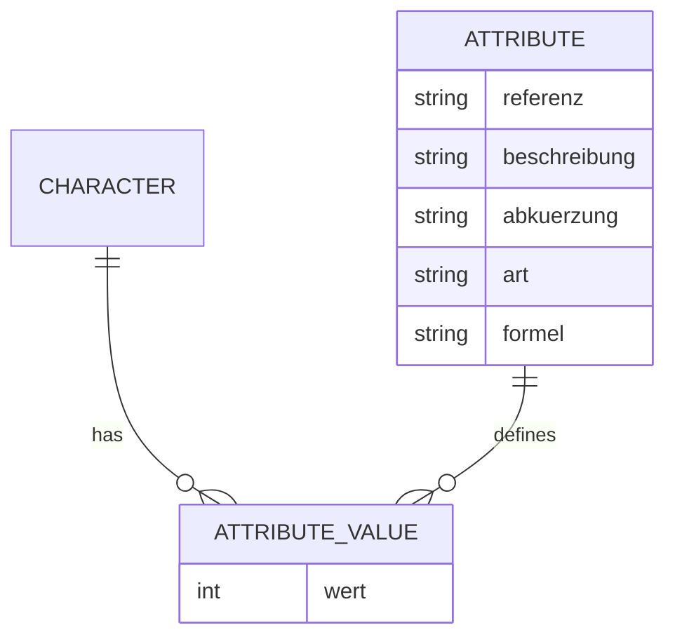

# Entities

## Attribute

```mermaid
erDiagram
    CHARACTER ||--o{ ATTRIBUTE_VALUE : has
    ATTRIBUTE ||--o{ ATTRIBUTE_VALUE : "defines"
    ATTRIBUTE {
        string referenz
        string beschreibung
        string abkuerzung
        string art
        string formel
    }
    ATTRIBUTE_VALUE {
        int wert
    }
```