# NPC-Erstellung: Achsen und SP-Wirkung

Stand: 13.09.2026. Übersicht des Planungsstands, keine neue Regelentscheidung oder Generatorumsetzung. Gruppierung dient der Orientierung; die Achsen bleiben unabhängig kombinierbar.

**SP** = direkte Käufe; **→ SP** = Auswahl löst passende Käufe aus, kein eigener Paketpreis; **± SP** = Kosten oder Gutschrift je Auswahl; **SP?** = konkrete Zuordnung noch offen. Unmarkierte Auswahlen haben keinen eigenen SP-Preis. TaP und Geld separat führen. Kostenmarkierungen sagen nichts über den Bestätigungsstand neuer Ausbildungsziele aus.

```mermaid
flowchart TB
    R["1 · RAHMEN UND HINTERGRUND<br/><br/>Name · Geschlecht · Alter<br/>Herkunftsort / Region / Welt<br/>Volk / Spezies → SP für Eigenschaftsminima<br/>Erfahrung: EP / Stufe / Kreis / Kreis+ → Budget<br/>Lebenswelt und Schwerpunkte → SP<br/>Herkunftsgelände → SP<br/>Soziale Lage → SP<br/>Rechtsstand · militärischer Rang<br/>Einheit · Dienststellung · Status<br/>Amt und Pflichten → SP bei Ausbildungsbedarf<br/>Aussehen ± SP · Schlaf 0 SP"]
    P["2 · PROFIL UND AUSBILDUNG<br/><br/>Beruf + Professionsgüte → SP<br/>Optionaler Zweitberuf + eigene Güte → SP<br/>Alltagsaufgabe und Schwerpunkt → SP<br/>NPC-Kategorie CK / Eigenschaftsziele → SP<br/>Optionale schlechte Eigenschaft ± SP<br/><br/>Kampfausbildung → SP<br/>Unbewaffnet · bewaffneter Nahkampf<br/>Bögen/Armbrüste · Feuerwaffen<br/>Kampfweise und Einsatz → SP bei Bedarf<br/>Haltung · Hauptaufgabe · Einsatzart · Zusammenarbeit<br/><br/>Magie: Keine / KI / Spruchmagie / PSI → SP + TaP<br/>Haupt-/Nebenaufgabe · Ausbildungsbreite<br/>Spruchmagie: Schulen und Schwerpunktschule<br/>Weihe: Ja/Nein · Religion/Sekte · Grad · Aufgabe → SP?<br/><br/>Sprache und Kultur: SP<br/>Schriftgebrauch und Zusatzsprachen → SP"]
    A["3 · AUSSTATTUNG<br/><br/>Waffen · Rüstung · Kleidung · Artefakte<br/>Berufs-/Lebensweltausrüstung · Qualität<br/>Geld; Nutzungsvoraussetzungen → SP<br/><br/>Rüstungslagen / KBE-Ziel → SP bei Bedarf<br/>Körperwerte und Rüstungsmanöver<br/><br/>Besitz: eigen / gestellt / geliehen / gemischt<br/>Versorgung · Einsatzdauer · Transport<br/>Geld; erforderliche Ausbildung → SP<br/><br/>Geldbeutel: mitgeführtes Bargeld"]
    K["4 · KÄUFE ZUSAMMENFÜHREN UND PRÜFEN<br/><br/>Eigenschaften: SP<br/>Attribute: SP · mindestens 3 %<br/>WHK: SP · mindestens 5 %<br/>SSK: SP · 90 SP Grundpaket<br/>GF/SF: SP · 9 je Punkt<br/>Basis 0; ca. 90 Punkte Obergrenze auf Stufe 0<br/>Kampffertigkeiten: SP<br/>Unbewaffnet mindestens 3 × Kreis<br/>Magische Fertigkeiten / Repertoire: SP<br/><br/>Talente: separates TaP-Budget<br/>Ausrüstung: separates Geldbudget<br/><br/>Pflichtvorgaben · Ersatzlösungen · optionale Wünsche<br/>Bausteinherkunft · Voraussetzungen · Budgetprüfung<br/>Jeden Kauf nur einmal bezahlen"]
    R --> P --> A --> K
```

## Reihenfolge der Berechnung

Volk/Erfahrung und Profil wählen → Spezies-Eigenschaftssockel bestimmen → bei Spruchmagie Schulen durch vorhandene Stärken gewichtet wählen → CK-Eigenschaftsziele und weitere Voraussetzungen ergänzen → tatsächliche Basisausgaben zusammenführen → Rest-SP bestimmen → daraus Spruchrepertoire finanzieren → alle Voraussetzungen und Budgets erneut prüfen.

Die Nummern im Diagramm ordnen die Themen; sie schreiben keine starre Reihenfolge der Eingaben vor. Ausrüstungsanforderungen müssen vor Abschluss der Basiskosten berücksichtigt werden. WHK-/Attributminima sind keine zusätzlichen Gebühren. Mindestziele per Maximum, echte verschiedene Hintergrundbeiträge nach ihren Additionsregeln zusammenführen; jeden endgültigen Kauf einmal bezahlen. Schulwahl bei Neuberechnung erhalten.

Schlaf kostet in allen vier Ausprägungen 0 SP. Aussehen kann SP kosten oder gutschreiben und zusätzliche Ausstrahlung verlangen. Beruf, Rang, Amt und Professionsgüte bleiben unabhängig. Ein Amt oder Rang vergibt keine kostenlosen Fähigkeiten. Reine Ausrüstungsanschaffung kostet Geld; SP betreffen nur erforderliche Charakterausbildung. Für Weihe ist die konkrete Ressourcen-/Fertigkeitszuordnung noch offen; kein pauschaler SP-Preis behauptet.

## Quellen, Stand und nächster Vorschlag

Abgeglichen mit [Template](Template-und-Arbeitsauftraege.md), [Weiteren Achsen](Weitere-Achsen.md), [Budgetgrundlage](Budgetgrundlage.md), [Eigenschaften und Attributen](Eigenschaften-und-Attribute.md), [Amt](Amt.md) und dem neuesten vollständigen [Übergabestand](Uebergabe.md). Neue Achsenoptionen und Teile der Ausbildung bleiben Entwürfe; Gewichtung der Schulen, CK-Zielhöhen und vollständige Finanzierung sind offen. Nur Dokumentation; keine App-Änderung oder Laufzeittests.

Nächster Vorschlag: Für jede SP-wirksame Achse Pflichtminimum, frei wählbare Vertiefung und noch offene Zielwerte festhalten. Dabei mit CK-Eigenschaftszielen und Schulgewichtung beginnen; erst nach bepreisten Basisausgaben Spruchzahlen festlegen. Noch kein Ausführungsauftrag.
